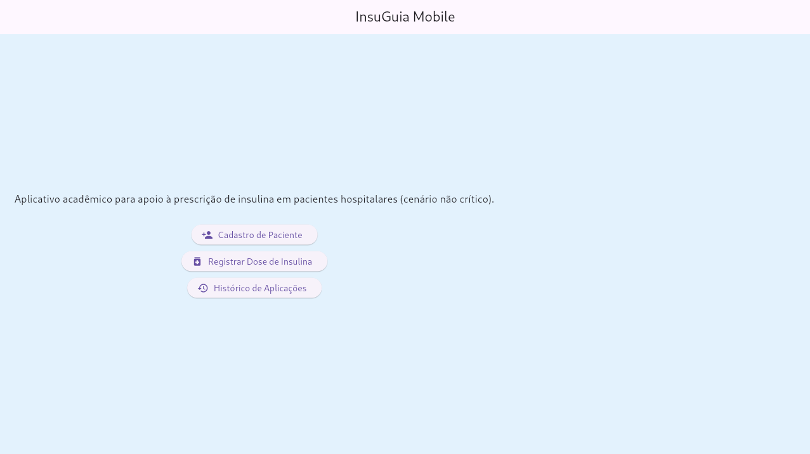
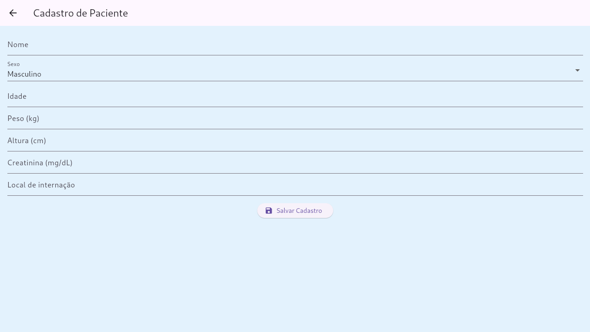
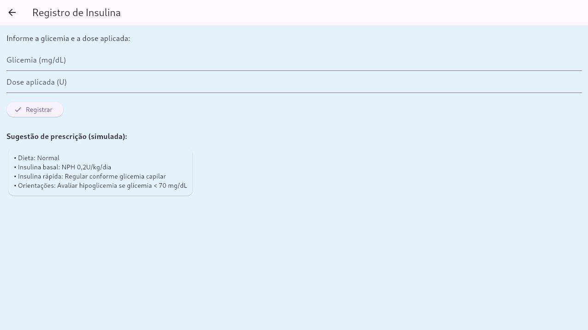
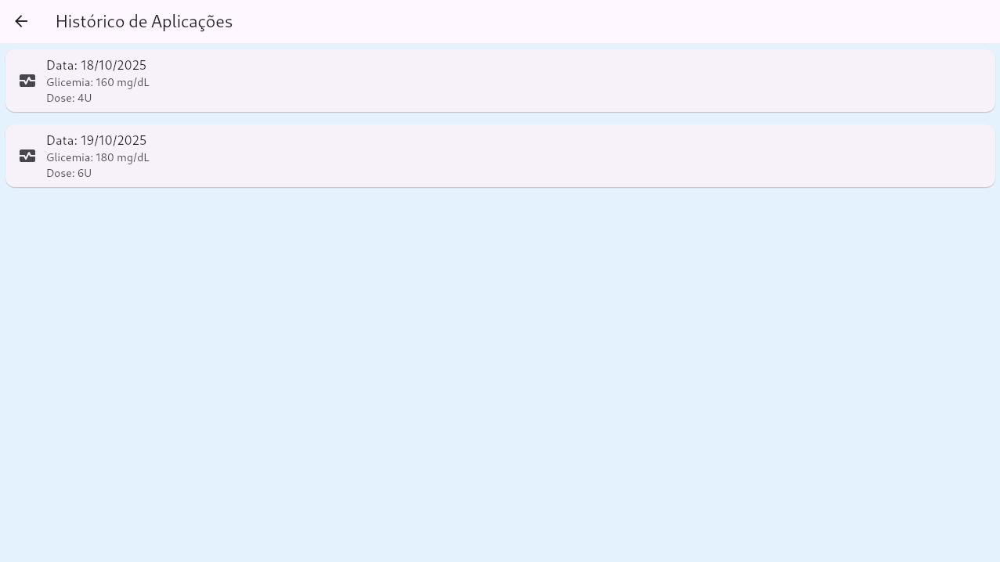

# 🩺 InsuGuia Mobile

## 📖 Contexto do Projeto
O **InsuGuia Mobile** é um aplicativo acadêmico desenvolvido em Flutter, com o objetivo de apoiar médicos no **manejo da hiperglicemia hospitalar** em pacientes não críticos.

O projeto é fruto de uma proposta apresentada pelo **Dr. Itairan da Silva Terres** na **UNIDAVI**.

---

## ⚙️ Funcionalidades Implementadas
- **Cadastro de paciente** (nome, idade, sexo, peso, altura, creatinina, local de internação)
- **Registro de glicemia e dose de insulina**
- **Sugestão simulada de prescrição**
- **Histórico de aplicações**
- Interface simples e intuitiva

---

## 🧩 Estrutura de Telas
- `TelaPrincipal` → Menu inicial com navegação
- `TelaCadastro` → Cadastro do paciente
- `TelaRegistroInsulina` → Registro e simulação de prescrição
- `TelaHistorico` → Lista de registros simulados

---

## 💡 Próximos Passos (para versão futura)
- Armazenamento local dos dados com `SharedPreferences`
- Implementação de fórmulas reais de cálculo de dose
- Tela de alta hospitalar com orientações

---

## 🧠 Tecnologias Utilizadas
- **Linguagem:** Dart  
- **Framework:** Flutter  
- **IDE recomendada:** VS Code

---

## 🖼️ Prints das Telas 

- Tela Principal  
    

- Tela de Cadastro
    

- Tela de Registro
    

- Tela de Histórico
    

---

## 📍 Equipe
- **Acadêmico:** Felipe Macedo e Guilherme Stein
- **Orientação:** Prof. Sandro Alencar Fernandes
- **Disciplina:** Desenvolvimento para Plataformas Móveis – UNIDAVI  
- **Ano:** 2025

---

## 🚀 Execução do Projeto
Para rodar o app localmente:

```bash
flutter pub get
flutter run